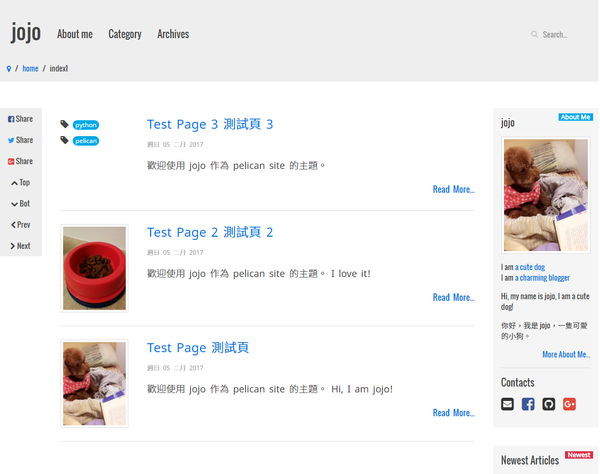
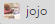
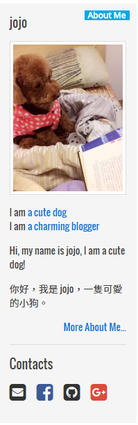
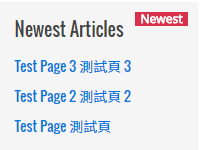
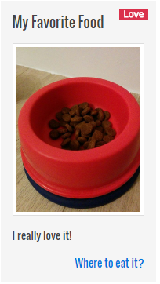
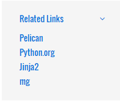
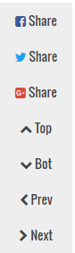
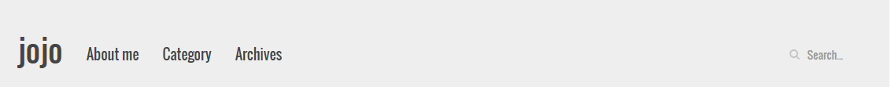
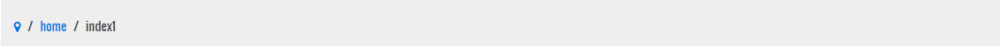
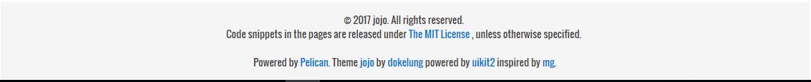

# jojo
A friendly Pelican theme



* [quick start](#quick-start)
* [features](#features)
* [requirements](#requirements)
* [pelican basic settings](#pelican-basic-settings)
 * [basic settings](#basic-settings)
 * [templates](#templates)
 * [paths](#paths)
* [core settings of jojo](#core-settings-of-jojo)
 * [site icon](#site-icon)
 * [settings of right side panels](#settings-of-right-side-panels)
  * [author panel](#author-panel)
  * [newest articles](#newest-articles)
  * [user specified simple panels](#user-specified-simple-panels)
  * [related links panel](#related-links-panel)
 * [settings of left side buttons](#settings-of-left-side-buttons)
 * [top elements](#top-elements)
  * [top navigator](#top-navigator)
  * [location panel](#location-panel)
 * [settings of footer](#settings-of-footer)
 * [comment system](#comment-system)

## quick start

```bash
$ git clone https://github.com/dokelung/jojo.git
$ cd jojo/examples
$ git clone https://github.com/getpelican/pelican-plugins.git
$ cd pelican-plugins
$ git clone https://github.com/burakkose/just_table.git
$ cd ..
$ pelican content -o output -s exconf.py
$ cd output
$ python -m pelican.server
```
open your browser and goto http://localhost:8000, that's all!

## features

* [uikit2](https://getuikit.com/v2/) based theme (have nice look and easy to modify)
* embedded site search engine [tipue_search](http://www.tipue.com/search/)
* better chinese article look, guided by [十項讓長文章更容易閱讀的原則](https://wanderer.tw/%E7%B0%A1%E5%96%AE%E5%81%9A%E5%A5%BD%E4%B8%AD%E6%96%87%E6%8E%92%E7%89%88/)
* [disqus](https://disqus.com/) comment system support

## requirements

Followings are my dev environments:

* python: 3.6.0
* pip: 9.0.1
* pelican: 3.7.1
* beautifulsoup4: 4.5.3
* uikit2

Require pelican plugins:

* tipue_search: need beautifulsoup4
* just_table
* representative_image: need beautifulsoup4

## pelican basic settings

Open `pelicanconf.py` to modify your settings:

### basic settings

See examples:

```python
AUTHOR = 'jojo'
SITENAME = 'jojo'
SITEURL = 'http://localhost:8000'
DEFAULT_PAGINATION = 10
```

### templates

To fully enable all features of jojo, please specify `DIRECT_TEMPLATES` as followings:

```python
DIRECT_TEMPLATES = ('index', 'categories', 'tags', 'archives', 'search')
```

### paths

Actually, you don't have to fully follow the settings below, but I recommand you to follow them:

```python
# content path
PATH = 'content'

# specify plugins
PLUGIN_PATHS = ['pelican-plugins']
PLUGINS = ['tipue_search', 'just_table', "representative_image"]

# just table settings
JTABLE_TEMPLATE = """
<table class="uk-table uk-table-striped">
    
    <caption> {{ caption }} </caption>
    
    
    <thead>
    <tr>
        
        <th> No. </th>
        
        
        <th>{{ head }}</th>
        
    </tr>
    </thead>
    
    <tbody>
        
        <tr>
            
            <td> {{ loop.index }} </td>
            
            
            <td>{{ entry }}</td>
            
        </tr>
        
    </tbody>
</table>
"""

# static
STATIC_PATHS = ['images', 'articles']

# articles
ARTICLE_PATHS = ['articles']
ARTICLE_URL = 'category/{category}/{slug}/'
ARTICLE_SAVE_AS = 'category/{category}/{slug}/index.html'

# pages
PAGE_URL = 'pages/{slug}/'
PAGE_SAVE_AS = 'pages/{slug}/index.html'

THEME = 'path/to/jojo' # specify your own path to jojo
```

## core settings of jojo

Open `pelicanconf.py` to modify your settings and remember to put all photos under `content/images` and just specify their base names in following settings:

### site icon

```python
SHORTCUT_ICON = 'jojo.jpg'
```



### settings of right side panels

jojo lets user set serveral panels in the right column, including:

1. an author panel (set by `AUTHOR_INFO`)
2. a newest articles panel (set by `NEWEST_ARTICLES`)
3. several user defined simple panel (set by `SIMPLE_PANELS`)
4. a related links panel (set by `RELATED_LINKS`)

#### author panel

```python
SOCIAL = {
    'style': {
        'size': 'medium', # small, medium, large
        'hover': True,    # True, False
        'button': False,  # True, False
    },
    # for SOCIAL, jojo supports uk-icon in uikit2
    # but jojo only recover following icons' color
    'icons': (
        ('envelope-square', '#'),
        ('facebook-square', '#'),
        ('github-square', '#'),
        ('google-plus-square', '#'),
        # ('linkedin-square', '#'),
        # ('skype', '#'),
        # ('twitter-square', '#'),
        # ('weixin', '#'),
    )
}

AUTHOR_INFO = {
    'id': AUTHOR,
    'photo': 'jojo.jpg',
    'intro_keywords': (
        ('a cute dog', '#'),
        ('a charming blogger', '#'),
    ),
    'intro': [
        'Hi, my name is jojo, I am a cute dog!',
        '你好，我是 jojo，一隻可愛的小狗。'
    ],
    'url': os.path.join(SITEURL, 'pages', 'about-me'),
    'social': SOCIAL,
}
```

* `SOCIAL` is a variable used in `AUTHOR` to specify your social network:
 * `style`: modify it to adjust the appearence of social icons
 * `icons`: specify the social icons you want with format `(ICON_NAME, URL)`
* `AUTHOR_INFO`
 * `id`: usually equal to `AUTHOR`
 * `photo`: photo of author (place this image under `content/images`)
 * `intro_keywords`: tuple of tuples, each item represents a hyper link specified by format `(TEXT, URL)`
 * `intro`: list of strings to describe author
 * `url`: the url of *about-me* page
 * `social`: dictionary used to specify social networks



#### newest articles panel

```python
NEWEST_ARTICLES = 10  # set 0 to hide this panel
```

* `NEWEST_ARTICLES`: an integer to specify the number of newest articles listed in *newest articles panel*.



#### user specified simple panels

```python
SIMPLE_PANELS = (
    {
        'badge': {
            'string': 'Love',
            # type can be specified as '' or 'success' or 'warning' or 'danger'
            # by default, '' is blue, 'success' is green, 'warning' is orange and 'danger' is red
            # please reference to uikit2
            'type': 'danger',
        },
        'title': 'My Favorite Food',
        'photo': 'food.jpg',
        'content': 'I really love it!',
        'link': ('Where to eat it?', '#'),
    },
)
```

* `SIMPLE_PANELS`: a variable to set user specified simple panel
 * `badge`: a dictionary
   * `string`: panel badge name
   * `type`: used to specify badge color
 * `title`: panel name
 * `photo`: pnael photo
 * `content`: string to describe panel
 * `link`: a tuple with format `(LINK_TITLE, URL)`



#### related links panel

jojo supports a related links with *Accordion* effect:

```python
RELATED_LINKS = (
    ('Pelican', 'http://getpelican.com/'),
    ('Python.org', 'http://python.org/'),
    ('Jinja2', 'http://jinja.pocoo.org/'),
    ('mg', 'https://github.com/lucachr/pelican-mg'),
)
```

* `RELATED_LINKS`: tuple of tuples, each element specify a related link with format `(LINK_NAME, URL)`



### settings of left side buttons

jojo supports button tools in the left side column, including:

1. a series of buttons to share your page to social networks (set by `SHARE_BUTTONS`)
2. a series of buttons for going to previous/next page and/or to top/bottom of the current page

```python
SHARE_BUTTONS = True
CONTROL_BUTTONS = True
```

* `SHARE_BUTTONS`: a boolean value
* `CONTROL_BUTTONS`: a boolean value



### top elements

jojo has a top navigator and a related links panel

#### top navigator

```python
NAV = {
    'sitename': SITENAME,
    'navitems': (
        {
            'primary': ('About me', AUTHOR_INFO['url']),
        },
        {
            'primary': ('Category', os.path.join(SITEURL, 'categories.html')),
            'secondary': (
                {'type':'header', 'name':'Programming'},
                {'link':('python', os.path.join(SITEURL, 'category', 'python.html')) },
                {'type':'divider'},
                {'link':('misc', os.path.join(SITEURL, 'category', 'misc.html'))},
            )
        },
        {
            'primary': ('Archives', os.path.join(SITEURL, 'archives.html')),
        },
    ),
    'tipue_search': True,
}
```
* `sitename`: the logo name of the site
* `navitems`: tuple of dictionaries, each element represents a menu item of navigator
 * `primary`: first class menu item with format `(ITEM_NAME, URL)`
 * `secondary`: the items of submenu, tuple of dictionaries
* `tipue_search`: a bool value, set `True` to turn on site search engine



#### location panel

```python
LOCATION = True
```

* `LOCATION`: a bool value, set `True` to enable location bar



### settings of footer

```python
FOOTER = {
    'year': 2017,
    'author': AUTHOR,
    'license': {
        'name': 'The MIT License',
        'link': 'https://opensource.org/licenses/MIT',
    }
}
```



### comment system

```python
# DISQUS_SITENAME = "your disqus shortname"
# DISQUS_CONFIG = True
```

* `DISQUS_SITENAME`: specify your disqus shortname here to enable disqus comments system
* `DISQUS_CONFIG`: set `True` to set disqus page identifier and page url for disqus to find thread and load content
